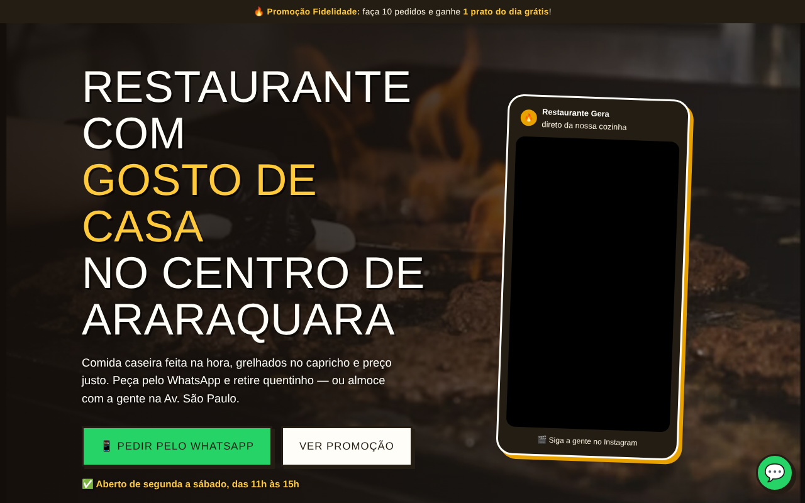
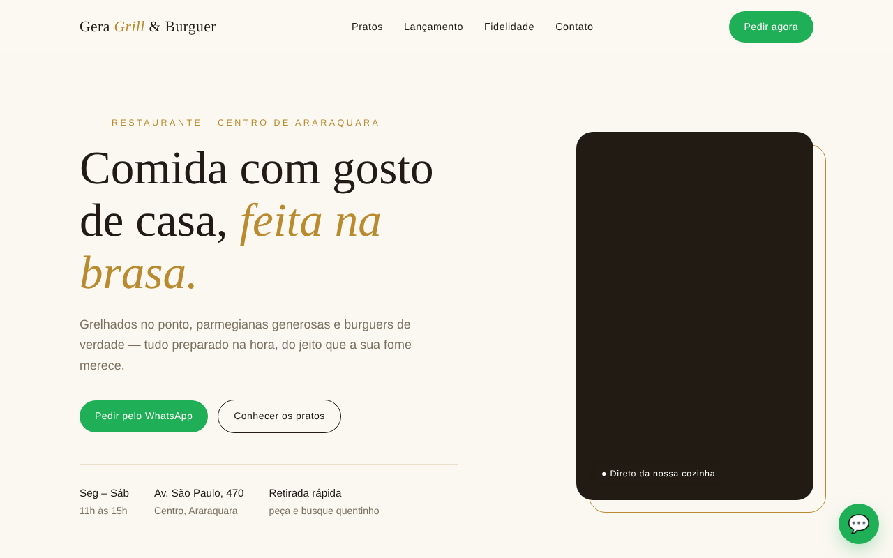

# Gera Grill — Site do restaurante

Landing page de um restaurante de Araraquara-SP, feita para atrair pedidos pelo WhatsApp. Projeto real, pago, desenvolvido em equipe em cerca de uma semana (site e sistema de pedidos). Participei do desenvolvimento.

**Tecnologias:** HTML, CSS e JavaScript

## O que o site faz

- Apresenta o restaurante, os pratos, o horário e o endereço
- Botão fixo e chamadas para pedir pelo WhatsApp
- Promoção de fidelidade em destaque
- Layout responsivo (celular e computador) e duas opções de visual para o cliente escolher

## Prints

> O código-fonte deste projeto não é público por se tratar de um trabalho comercial para cliente.
